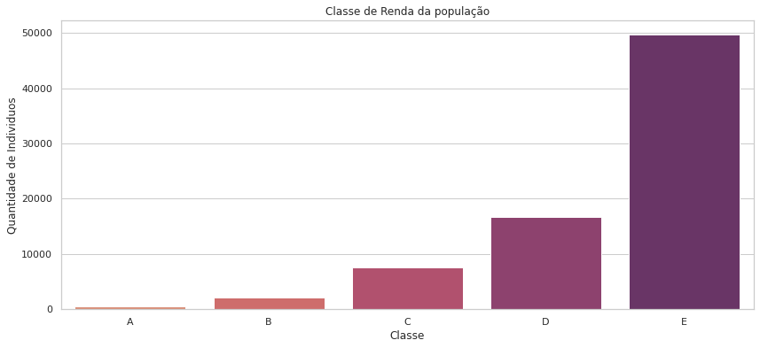
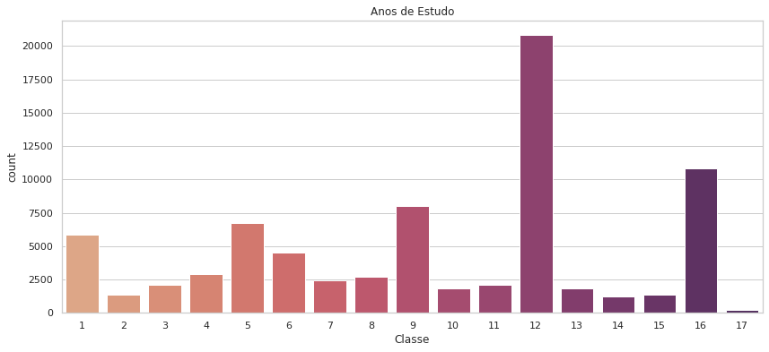
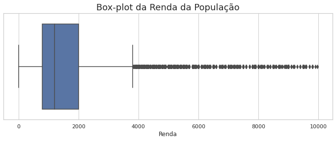
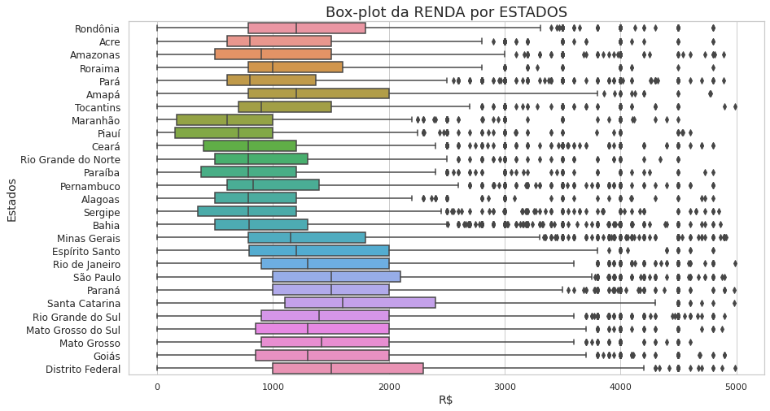
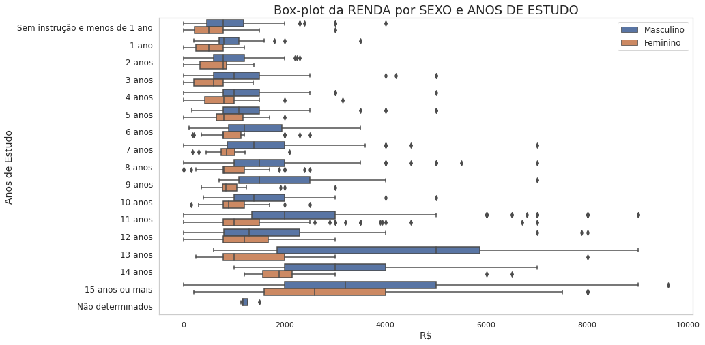

# Análise Descritiva do Conjunto de Dados do IBGE

Esta pesquisa vai analisar dados disponiveis pelo IBGE sobre a população. O dataset utilizado contém dados relacionados ao Sexo, Idade, Cor, Anos de Estudo, Renda e Altura da população basileira, do ano de 2015. Foram criados histogramas, calculados e avaliados medidas de tendência central, medidas separatrizes e de dispersão dos dados.

Dataset disponivel em: https://www.ibge.gov.br/estatisticas/sociais/populacao/9127-pesquisa-nacional-por-amostra-de-domicilios.html?=&t=microdados

Obs: Essa é uma atividade do curso de Probabilidade e Estatistica 1, ministrada pela Alura.

Alguns dos resultados das análises foram:

- Frequencia da variavel Renda de acordo com a classe

- Frequencia da variavel Anos de Estudo

- Box-plot da Renda da População

- Box-plot da RENDA por ESTADOS

-Box-plot da RENDA por SEXO e ANOS DE ESTUDO

